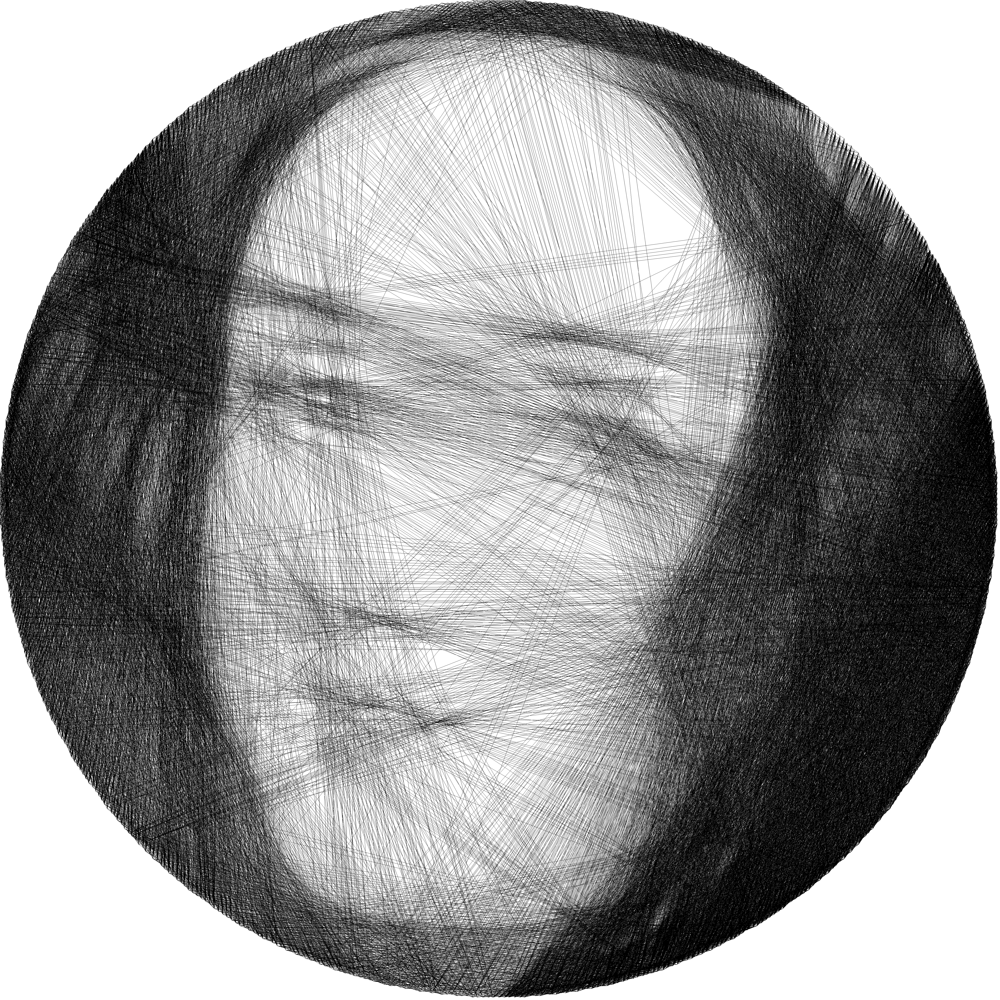
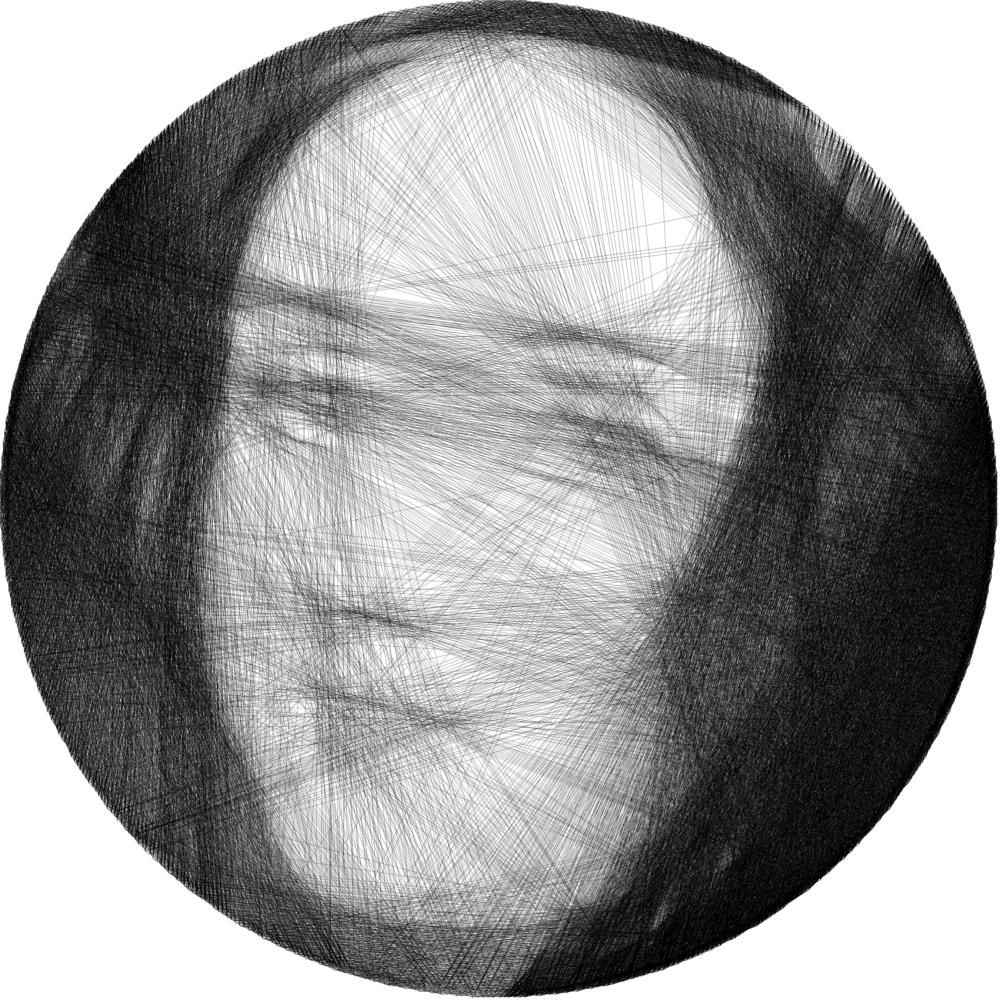

# String-art
Implementazione C++, SIMD e CUDA di un algoritmo di String Art per generare immagini tramite linee rette.\
La String-Art è una tecnica di disegno che permette di ottenere immagini totalmente composte da linee rette. Per iniziare il procedimento, viene fornita in input un'immagine, sulla quale circonferenza vengono posizionati un numero di chiodi scelti dall'utente. A partire da questi chiodi, ne viene scelto uno casuale dal quale partiranno una serie di linee rette che lo collegheranno agli altri chiodi (esclusi quelli vicini). Tra tutte queste linee verrà scelta quella più scura, ovvero la linea che, una volta sovrapposta all'immagine originale, ha come somma dei valori dei pixel che la compongono il risultato più basso. In output si ottiene l'immagine creata attraverso questo algoritmo. 
Il problema è stato scelto in quanto permetteva un ampio margine di miglioramento nel tempo di esecuzione; questo è dovuto all'algoritmo che, per ogni potenziale linea, deve determinare quali pixel attraversa. Fare questa iterazione sulla CPU, in maniera sequenziale, richiede molto tempo. 

## Usage

Per runnare lo script

```
string_art input.pgm num_pins opacity threshold skipped_neighbors output.pgm
```

dove
 - `input.pgm` è un'immagine graymap portatile "P5" binaria quadrata senza commenti (dimensione consigliata: `512x512`),
 - `num_pins` è il numero di pin (consigliata: `256`),
 - `opacity` è il fattore di opacità (consigliata: `0.2`, un valore più alto significa un'immagine più luminosa),
 - `threshold` è la soglia che indica il punteggio sotto al quale prendere (consigliata: `255`),
 - `skipped_neighbors` è il numero di pin vicini che vanno ignorati (consigliato: `32`),
 - `scale_factor` è il fattore di scala dell'immagine output (consigliato: `8`),
 - `output` immagine di output.

Esempio

```
string_art input.pgm 256 0.2 255 32 8 output.pgm
```

Per convertire immagine da pmg a png (e viceversa)
```
convert output.pgm -colorspace Gray output.png
```

## Risultati C++


## Risultati SIMD


## Risultati Cuda Naive



## Risultati CUDA


